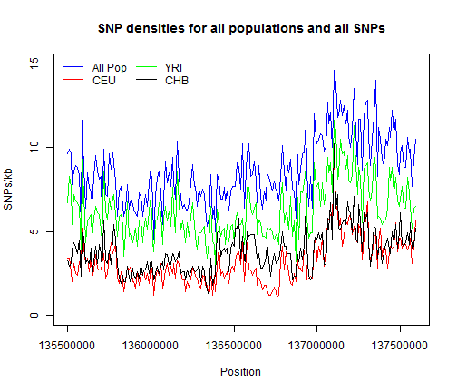
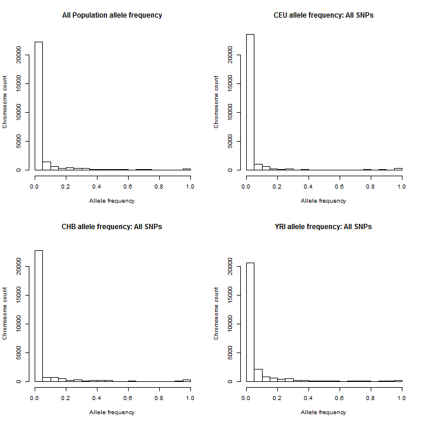
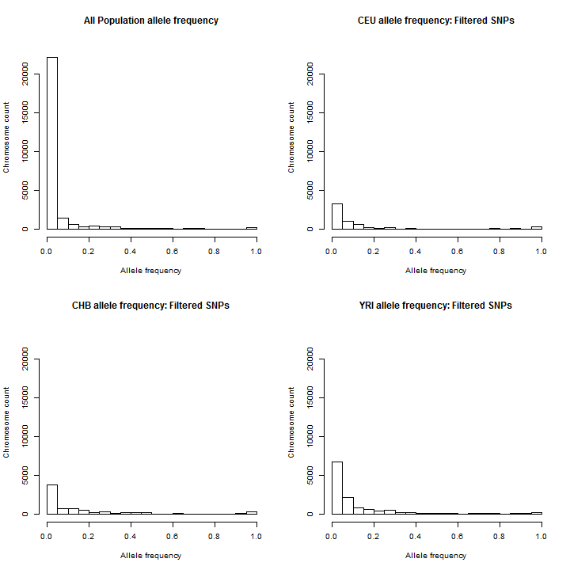
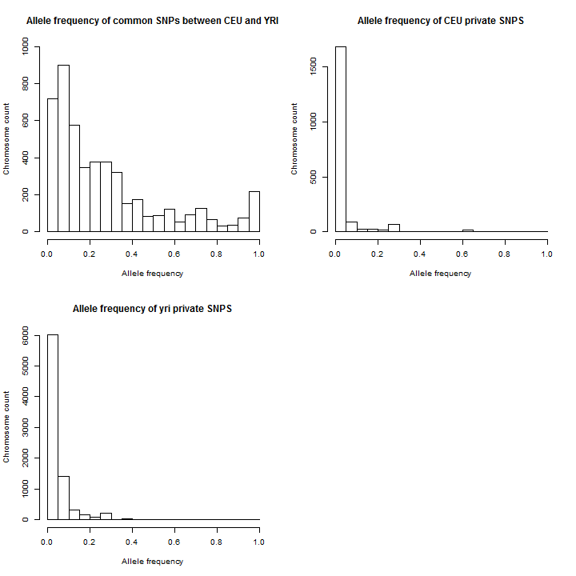
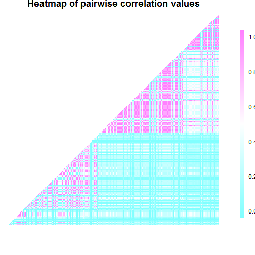

CGE Final Exam: Adam Auton
========================================================

## Plotting SNP density ##

SNP densities calculated using VCFtools. I used *region3* for this question. SNP density was calculated for 10kb regions for all populations, CEU, YRI, and CHB populations.

Density information was first loaded into R.

### Density Plot ###
Plotting density of rare SNPs (maf <= 0.001) for each population.

 

Average SNP densities for each population are shown in Table 1.

Table 1: Average Density per population

Population | Average Density
--- | ---
All_pops | 8.63857142857143
CEU | 3.17238095238095
YRI | 6.27619047619048
CHB | 3.79714285714286

### Interpretation of density plot ###

The average SNP density is different for each population. The YRI population contains the most variation among the three populations while the CEU and CHB populations have similar SNP densities. The mean densities are shown in *Table 1*.

This may be due to the reduction of genomic diversity as populations migrated out of Africa.

## Frequency spectrum ##

Frequency for each population was calculated using VCFtools.

 

Upon examination of the SNP frequencies for each population, there are many SNPs that are not polymorphic in some populations. The following plots show allele frequencies after removing SNPs that have an allele frequency of 0 in the given population. 

 

### Interpretation of Frequency plots ###

The frequency plots show a large number of rare variants within the human genome. When looking at all populations together, there is a large spike in the number of subjects that cary a rare allele. The cause of this is partly due to the presence of variants that are only seen in a subset of populations. Each population has more rare variants than common and some variants are unique to individual populations. The presence of variants that are population private causes the enrichment of low allele frequency when the populations are combined.

## The result of combined low and high coverage ##

One pitfall of combining low and high sequencing coverage is that the low coverage areas are more suceptible to errors in DNA amplification and sequencing. In low coverage areas, sequencing errors may result in some reads being called with an alternative allele and there is a higher chance that the resulting SNP will be called heterzygous when it is in reality, homozygous. 

Another consequence of low coverage is that there is reduced power to detect rare variants. 

## SNPs common to multiple populations ##

 

### Interpretation of Frequency Plots ###
SNPs that are common to the two populations have a larger proportion of SNPs with higher allele frequencies. The median allele frequency for CEU-YRI snps is: 0.1923 while the median allele frequencies for CEU and YRI are: 0.0118 and 0.0227 respectively. 

The SNPs that are unique to individual populations are overwhelmingly SNPs with allele frequencies of <0.1. It is possible that more common SNPs point to regions of shared genetic material between populations while rare SNPs differentiate the differen populations.

## Squared Correlation Coefficient Analysis ##

 

The squared correlation coefficient relates to the linkage disequilibrium between two SNPs. A strong correlation, value close to 1, indicates two SNPs are seen together often, meaning they are inherited together. The blocks show regions of the chromosome that are inherited together. In this example, region3, there are three large blocks of SNPs that are inherited together. The further away two SNPs are, the more likely they will be separated during recombination leading to lower correlation between the two SNPs. 
